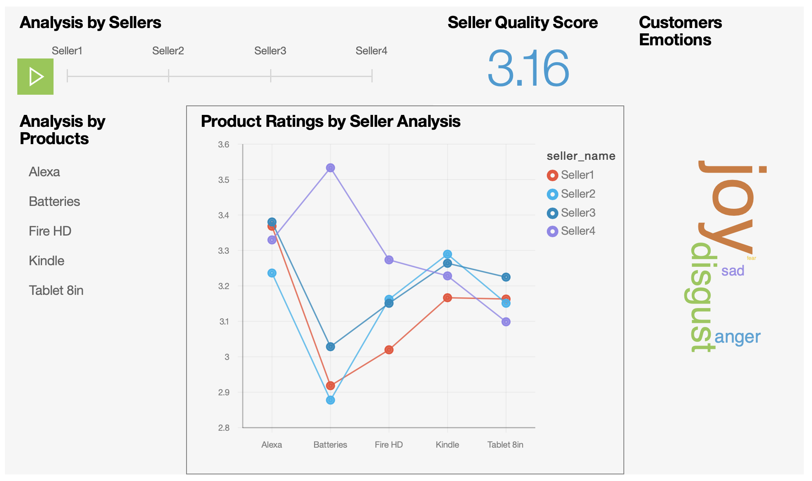

# Customer sentiment on seller quality with Watson Natural Language Understanding on Cloud Pak for Data

In this code pattern, we will analyse the seller's quality by understanding the sentiments and emotions of reviews given by customers to the sellers using Watson Natural Language Understanding on Cloud Pak for Data. 

In any E-Commerce website the product sellers have a rating between 0 to 5 stars which are explicitly given by the customers based on the product that have been purchased. Considering this rating into account the customers feel confident enough to purchase products from the particular seller. 

The rating which is given to a seller on e-commerce platform is just a rating given explicitly by the customers and does not make more impact to the sellers quality. We are adding more parameters to this rating to make it stronger and more impactful. We read the product reviews of a seller and analyse the sentiment and emotion behind the review with Watson Natural Language Understanding and compute a score, we also analyse the delivery status of the product and whether the product is delivered on or before the estimated date of delivery and compute another score, finally we sum up these scores to get a seller quality rating between 0 to 5 stars which makes more impact to the seller ratings.

When you have completed this code pattern, you will understand how to:

* Use advanced NLP to analyze text and extract meta-data from content such as sentiment, emotion, relations, etc.
* Run small pieces of code to process your data and immediately view the results with Jupyter Notebook.
* Use Data Refinery to prepare training data for an Machine Learning task.
* Build Interactive dashboards and produce visualizations directly from your data in real-time with Embedded Dashboard.

<!--add an image in this path-->

<!--Optionally, add flow steps based on the architecture diagram-->
## Flow

1. Create a connection for the refined data in db2 into IBM Watson Studio project in Cloud Pak for Data
2. Setup Jupyter Notebook that reads the dataset from the IBM db2 Connection
3. Run the Algorithm from Jupyter notebook that computes the seller rating with the help of Watson Natural Language Understanding on Cloud Pak for Data
4. Visualise insights from the data using Watson Embedded Dashboard on Cloud Pak for Data

<!--Optionally, update this section when the video is created-->
## Pre-requisites
- Implementation of this Code Pattern requires a basic understanding of Data Refinery and it also makes use of the dataset created in the tutorial [Prepare your Dataset for your ML Models using Data Refinery](https://github.com/IBM/prepare-your-dataset-using-data-refinery-from-db2-cp4d). Please complete the above tutorial before implementing this code pattern.

- Any SQL Database. 
>In this Code Pattern we demonstrate using [Db2 on Cloud Pak for Data](https://www.ibm.com/support/producthub/icpdata/docs/content/SSQNUZ_current/cpd/svc/db2z/create_database_db2z.html)

- [IBM Cloud Account](https://cloud.ibm.com/)

## Steps

Follow the **Deploy on Cloud Pak for Data** Instructions if you wish to deploy on Cloud Pak for Data or **Deploy on IBM Cloud** Instructions if you wish to deploy on IBM Cloud.

## Deploy on Cloud Pak for Data

Follow the Instructions to deploy on Cloud Pak for Data.

- [Deploy on Cloud Pak for Data](https://github.com/IBM/customer-sentiment-on-seller-quality-nlu-cp4d/blob/master/deploy-on-cloud-pak.md)

## Deploy on IBM Cloud

Follow the Instructions to deploy on IBM Cloud.

- [Deploy on IBM Cloud](https://github.com/IBM/customer-sentiment-on-seller-quality-nlu-cp4d/blob/master/deploy-on-cloud.md)

<!--Add a section that explains to the reader what typical output looks like, include screenshots -->

## Sample output

<!-- keep this -->
## License

This code pattern is licensed under the Apache License, Version 2. Separate third-party code objects invoked within this code pattern are licensed by their respective providers pursuant to their own separate licenses. Contributions are subject to the [Developer Certificate of Origin, Version 1.1](https://developercertificate.org/) and the [Apache License, Version 2](https://www.apache.org/licenses/LICENSE-2.0.txt).

[Apache License FAQ](https://www.apache.org/foundation/license-faq.html#WhatDoesItMEAN)
