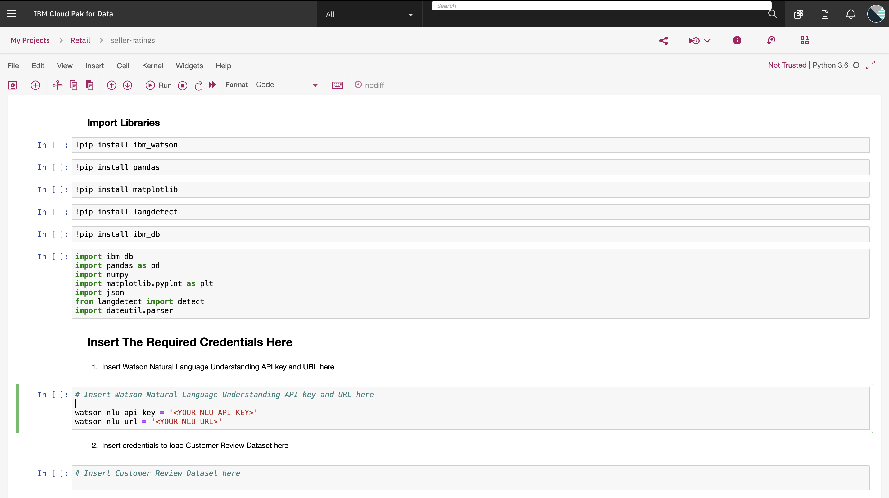
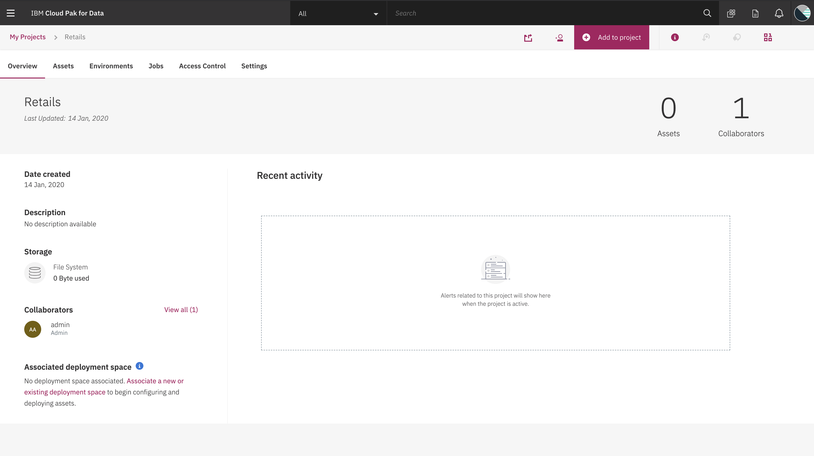

# Deploy on Cloud Pak for Data

## Steps

1. [Download the Dataset](#1-download-the-dataset)
2. [Create a Watson Natural Language Understanding Service](#2-create-a-watson-natural-language-understanding-service)
3. [Create a Project](#3-create-a-project)
4. [Add Db2 Connection to the Project](#4-add-db2-connection-to-the-project)
5. [Prepare and Run the Jupyter Notebook](#5-prepare-and-run-the-jupyter-notebook)
6. [Create Embedded Dashboard Service](#6-create-ibm-streaming-analytics-service)
7. [Visualize the Dashboard](#7-visualize-the-dashboard)

### 1. Download the Dataset
In this Code Pattern we are going to use **Customised version of Brazilian E-Commerce Public Dataset by Olist** that we created in the Tutorial [Prepare your Dataset for your ML Models using Data Refinery from Db2](https://github.com/IBM/prepare-your-dataset-using-data-refinery-from-db2-cp4d).

We are also going to use **Consumer Reviews of Amazon Products** from Kaggle. Download the dataset from the link below.

- https://www.kaggle.com/datafiniti/consumer-reviews-of-amazon-products

After Downloading, Extract the `consumer-reviews-of-amazon-products.zip` file.

We’ll be using the following files:

[Datafiniti_Amazon_Consumer_Reviews_of_Amazon_Products_May19.csv]() : This dataset is a list of over 28,000 consumer reviews for Amazon products like the Kindle, Fire TV Stick, and more from Datafiniti's Product Database updated between February 2019 and April 2019.

As we don’t have a proper dataset with product reviews and product delivery status, we are cooking up the dataset by _assuming_ 
that the products from the **Customised version of Brazilian E-Commerce Public Dataset by Olist** and the **Consumer Reviews of Amazon Products** are the same.

### 2. Create a Watson Natural Language Understanding Service

We will be using Watson Natural Language Understanding service to read the comments of the customer and analyse the Sentiment and Emotions of the Customers review.

* Create a [Watson Natural Language Understanding](https://cloud.ibm.com/catalog/services/natural-language-understanding) service on IBM Cloud.

* Once the service is created copy the **API Key** and **URL** of the service as shown. 

 

**NOTE: These credentials are important as it will be used in [step 5](#5-prepare-and-run-the-jupyter-notebook)**

### 3. Create a Project

* Create a Project in Cloud Pak for Data choose an Empty Project.

* Once The Project is Created you will see the below page.

### 4. Add Db2 Connection to the Project

Now that we have created a project, we will start adding components to our project. We will start by adding Db2 Connection to our project first.

* Click on **Add to Project** and select **Connection**. If you have followed [step 2](#2-load-the-data-into-tables-in-db2) select **Db2** from the list and add the credentials of your provisioned Db2 Instance. If you have a different database then you can select that and fill in the credentials.

* After filling the credentials click on **Test Connection** to make sure you have entered correct credentials. Finally select **Create**.

**NOTE: The Database Credentials will be provided by your Database administrator. If you have provisioned a Db2 instance on Cloud Pak for Data then you can follow the steps [here](https://www.ibm.com/support/knowledgecenter/SSQNUZ_2.1.0/com.ibm.icpdata.doc/zen/admin/create-db.html#create-db) to get the credentials.**

### 5. Prepare and Run the Jupyter Notebook

We have successfully created a project and added Db2 Connection to our project. We will now add the required credentials to our python Jupyter notebook and run the notebook.

#### 5.1. Prepare the Notebook
* Add Jupyter notebook to the Project by clicking on **Add to Project** and select **Notebook**. Click on **New Notebook from URL** and paste the below URL and create a Notebook.
- [https://github.com/IBM/customer-sentiment-on-seller-quality-nlu-cp4d/blob/master/notebook/customer-sentiment-on-seller.ipynb](https://github.com/IBM/customer-sentiment-on-seller-quality-nlu-cp4d/blob/master/notebook/customer-sentiment-on-seller.ipynb)

* Once the notebook is created we will have to fill in 4 Cells with the following: 
  - Watson Natural Language Understanding Credentials
  - Upload the Consumer Reviews of Amazon Products dataset and insert Pandas Dataframe
  - Insert the Customised version of Brazilian E-Commerce Public Dataset by Olist from Db2
  - Insert Db2 Credentials into the Notebook
      

#### 5.2. Run the Notebook

### 6. Create Embedded Dashboard Service
### 7. Visualize the Dashboard
