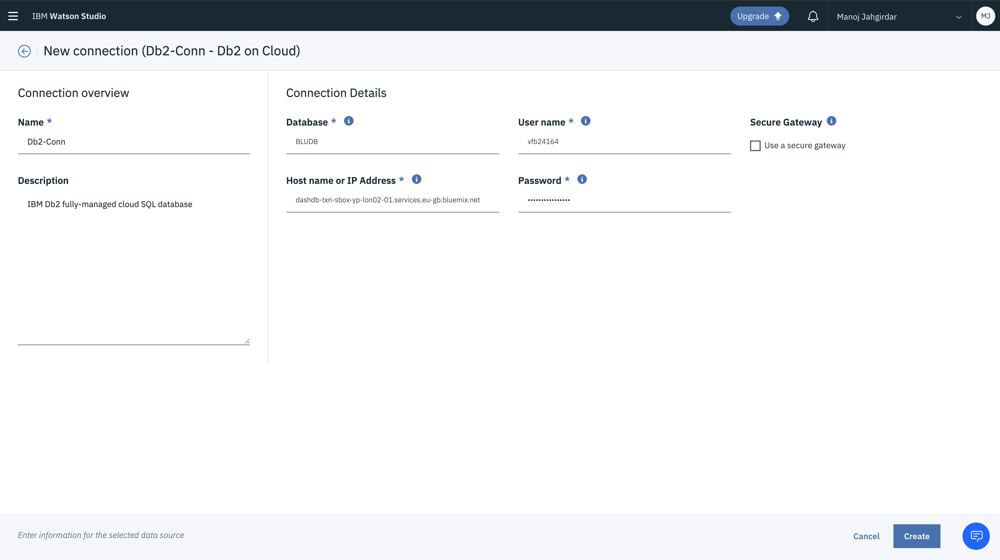

# Deploy on IBM Cloud

## Steps

1. [Download the Dataset](#1-download-the-dataset)
2. [Create Watson Natural Language Understanding Service](#2-create-a-watson-natural-language-understanding-service)
3. [Create Watson Studio Service](#3-create-watson-studio-service)
4. [Add Db2 Connection to the Project](#4-add-db2-connection-to-the-project)
5. [Prepare and Run the Jupyter Notebook](#5-prepare-and-run-the-jupyter-notebook)
6. [Create Embedded Dashboard Service](#6-create-ibm-streaming-analytics-service)
7. [Visualize the Dashboard](#7-visualize-the-dashboard)

### 1. Download the Dataset
In this Code Pattern we are going to use **Customised version of Brazilian E-Commerce Public Dataset by Olist** that we created in the Tutorial [Prepare your Dataset for your ML Models using Data Refinery from Db2](https://github.com/IBM/prepare-your-dataset-using-data-refinery-from-db2-cp4d).

We are also going to use **Consumer Reviews of Amazon Products** from Kaggle. Download the dataset from the link below.

- https://www.kaggle.com/datafiniti/consumer-reviews-of-amazon-products

After Downloading, Extract the `consumer-reviews-of-amazon-products.zip` file.

We’ll be using the following files:

[Datafiniti_Amazon_Consumer_Reviews_of_Amazon_Products_May19.csv]() : This dataset is a list of over 28,000 consumer reviews for Amazon products like the Kindle, Fire TV Stick, and more from Datafiniti's Product Database updated between February 2019 and April 2019.

As we don’t have a proper dataset with product reviews and product delivery status, we are cooking up the dataset by _assuming_ 
that the products from the **Customised version of Brazilian E-Commerce Public Dataset by Olist** and the **Consumer Reviews of Amazon Products** are the same.

### 2. Create Watson Natural Language Understanding Service

### 3. Create Watson Studio Service

* Create [**Watson Studio**](https://cloud.ibm.com/catalog/services/watson-studio) service.

* Then click on **Get Started**.

* In Watson Studio click **`Create a project > Create an empty project`** and name it **_`Retail`_**.

### 4. Add Db2 Connection to the Project

Now that we have created a project, we will start adding components to our project. We will start by adding Db2 Connection to our project first.

* Click on **Add to Project** and select **Connection**. If you have followed [step 2](#2-load-the-data-into-tables-in-db2) select **Db2** from the list and add the credentials of your provisioned Db2 Instance. If you have a different database then you can select that and fill in the credentials.

* After filling the credentials click on **Create**.

### 5. Prepare and Run the Jupyter Notebook

### 6. Create Embedded Dashboard Service
### 7. Visualize the Dashboard
